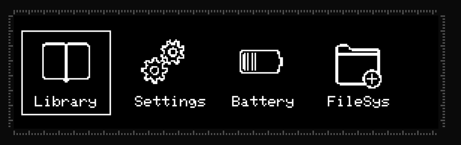
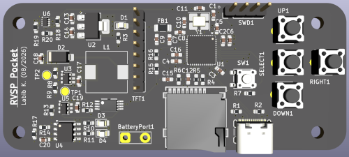
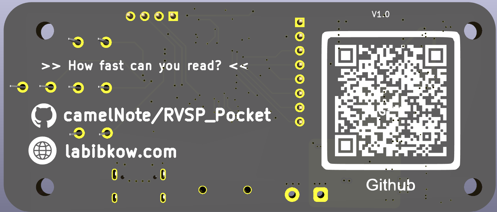

 # RVSP Pocket 📖

## Overview

Rapid Serial Visual Presentation is a reading technique of presenting text in a single focal point to reduce eye movement. The aim is maximize reading throughput without compromising understanding. 

RVSP Pocket is a STM32F4 "soft" fork of the [RVSP Nano](https://github.com/ionutdecebal/rsvpnano). RVSP Pocket aims to be a more hardware optimized version of the RVSP Nano, cheaper, and more compact. Currently the project is in the protyping stage, but here's the planned features pipeline:

* Local web app to decompress popular ebook file format (.epub)
* USB-C MSC file to transfer files directly to SD card
* 3D printed case

## Visual of Menu
</img>
> Built using Lopaka

## Bill of materials

- Item 1
- Item 2
- Item 3
- Item 4

## Installation

1. Clone the repository.
2. Install any required dependencies.
3. Open the project in your development environment.
4. Build and upload the project as needed.

## PCB
</img>
</img>

## To-do

- [ ] Add project description
- [ ] List required components
- [ ] Add setup instructions
- [ ] Document future improvements
