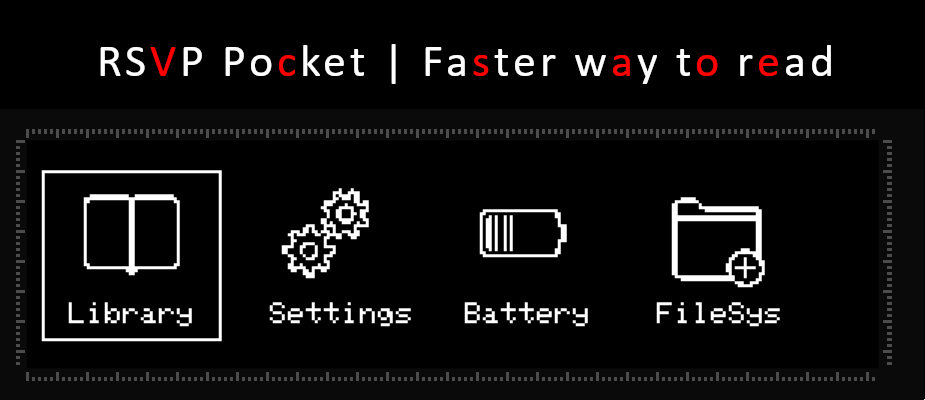
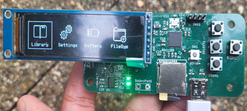
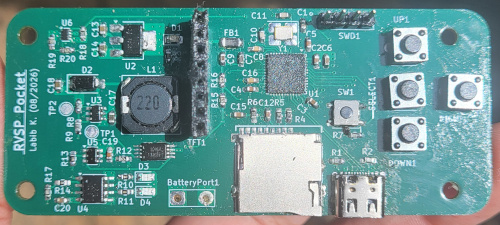
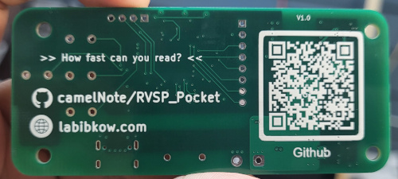

 # RSVP Pocket 📖
</img>

## Overview
### <i> How fast can you read? </i> 
Rapid Serial Visual Presentation is a reading technique of presenting text in a single focal point to reduce eye movement. The aim is maximize reading throughput without compromising understanding. 

RVSP Pocket is a STM32F4 "soft" fork of the [RVSP Nano](https://github.com/ionutdecebal/rsvpnano). RVSP Pocket aims to be a more hardware optimized version of the RVSP Nano, cheaper, and more compact. Currently the project is in the protyping stage, but here's the planned features pipeline:

> Features:
> * Localized simple Angular webapp to convert .epub files into .txt file that the MCU can decode quickly
> * Single cell battery charging circuitry with overvoltage & overcurrent protection. Power mux also included to reliably switch from battery power to USB when connected, removing the possibility of calibration error in charging circuit.
> * Can act as a USB Mass Storage Class (MSC) device: Allowing user to access microSD on their laptop! Essentially can act as an USB microSD card reader (which can cost anywhere from $15 to $30!)
> * 25 MHz external HSE that enables the STM32F4 family of chips to run at maximum rated system clock of 84 Mhz.

### Current V1 of board: (It looks better in person!)
</img>

## Bill of materials
BOM can be found at /PCB/RSVP_Pocket.csv
* Notes: (1) the only external part not included is the TFT screen. Please use 2.25" (76x284) display module with ST7789 Driver. (2) All of these parts are interchangeable with similarly speced components. Please ensure the footprints match though!

## Installation
This project is built using platformio which is a VS Code extension. You may also choose to flash the .elf (/.pio/build/genericsSTM32F401CC/firmware.elf) using the STM32CubeProgrammer.

Using Platformio:
1. Clone the repository.
2. Open the folder in VS Code and check the platformio.ini file. Ensure that it makes the specs of your components.
3. Program via either the Serial Wire Debug header pins or USB. In your platformio.ini file, make sure to define which upload protocol is being used:
> For SWD using an STlink: upload_protocol = stlink  
> For USB: upload_protocol = dfu

## PCB
### 3D view
</img>
</img>

### V1 Manufractured and soldered (by hand!)
</img>
</img>